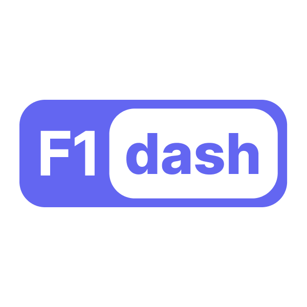

  <picture>
    <source media="(prefers-color-scheme: dark)" srcset="./dash/public/tag-logo.png" width="200">
    
  </picture>

<h1 align="center">Real-time Formula 1 telemetry and timing</h1>

## HYPERACING

A data driven, interactive motorsports betting app

## details

the F1 Analytics dashboard is a fork of F1-Dash made by SlowlyDev (https://github.com/slowlydev/f1-dash)

## notice

This project/website is unofficial and is not associated in any way with the Formula 1 companies. F1, FORMULA ONE, FORMULA 1, FIA FORMULA ONE WORLD CHAMPIONSHIP, GRAND PRIX and related marks are trade marks of Formula One Licensing B.V
